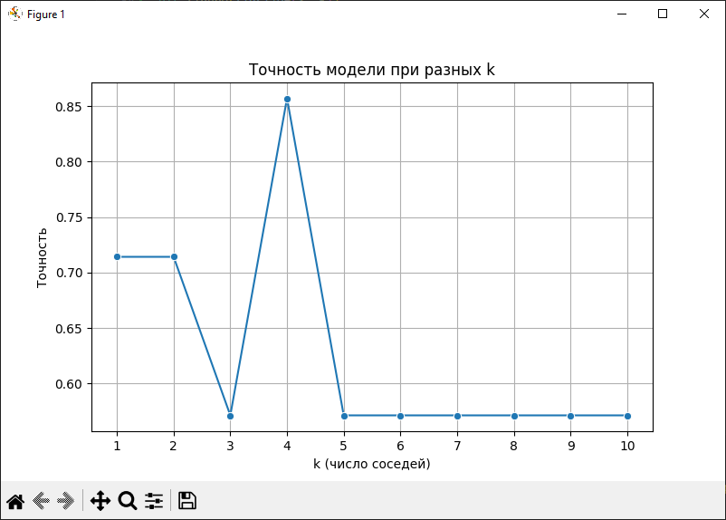

# Определение типа телефона по данным о пользователях

## Описание проекта
Данный проект представляет собой консольную программу на языке Python, которая по набору числовых признаков предсказывает, какой телефон использует респондент — **iPhone (код 1)** или **Android (код 2)**. Входные данные берутся из подготовленного файла `practice_1.csv` (разделитель `;`). В датасете отсутствуют пропуски, все значения приведены к числовому виду, а названия признаков сокращены и переведены на английский для удобства работы.  

Для загрузки и обработки таблицы используется библиотека **pandas**, которая позволяет читать CSV и хранить данные в формате `DataFrame`. Для машинного обучения применяется библиотека **scikit-learn**: выборка делится на обучающую и тестовую с помощью `train_test_split`, после чего обучается классификатор ближайших соседей `KNeighborsClassifier` с параметром `n_neighbors=5`.  

## Как работает программа
1. Загружается исходный датасет и формируются признаки `X` и целевая переменная `y = PhoneType`.  
2. Данные делятся на обучающую и тестовую части. На обучающей выборке строится модель.  
3. При запуске программа запрашивает у пользователя количество соседей для алгоритма и задаёт пользователю вопросы по каждому признаку (например: «Сколько раз в день заряжаете телефон?» или «Какой у вас браузер?»). Ввод допускается только числовой; при ошибке ввод запрашивается повторно.  
4. После того как все ответы собраны, они объединяются в однострочный `DataFrame` и передаются в модель.  
5. Алгоритм делает предсказание, и в консоли выводится результат: «Предположительный телефон: Айфон» или «Предположительный телефон: Андроид».
6. После предсказания отрисовывается график с помощью t-SNE, метода визуализации данных высокой размерности путём их преобразования в 2D или 3D пространство.

Таким образом, программа выполняет полный цикл: от чтения данных и обучения модели до интерактивного опроса и выдачи результата пользователю.  

## Алгоритм K-ближайших соседей
Основой программы является алгоритм **K-Nearest Neighbors (KNN)**. Его идея заключается в том, что класс нового объекта определяется по классам наиболее близких к нему примеров из обучающей выборки.  

Для измерения близости используется **евклидово расстояние**. Для двух объектов  
$x = (x_1, x_2, ..., x_n)$ и $y = (y_1, y_2, ..., y_n)$ оно вычисляется так:  

$$
d(x, y) = \sqrt{\sum_{i=1}^{n} (x_i - y_i)^2}
$$

При предсказании программа ищет $k$ ближайших соседей нового объекта и определяет, какой класс встречается среди них чаще всего. Формально решение записывается формулой:  

$$
\hat{y} = \arg\max_{c \in C} \sum_{i \in N_k(x)} [y_i = c]
$$

где $C$ — множество классов (в нашем случае {iPhone, Android}),  
$N_k(x)$ — множество индексов $k$ ближайших соседей для объекта $x$,  
а $[y_i = c]$ — индикатор (равен 1, если сосед имеет класс $c$, иначе 0).  

## Тестирование
Запустим код. Программа выведет график точности модели при разных k:

Нетрудно заметить, при каком значении k модель будет самой точной. Установим значение количества соседей равным четырем:                                                

Для проверки точности предсказания написанной программы исключим из датасета строку с информацией о респонденте – пользователе Андройд устройства. Значения удаленной строки:
2; 1; 1; 2; 2; 1; 4; 1; 3; 1; 4; 1; 2; 1; 2; 70000; 3; 2; 4; 1; 1.
Запустим программу, введем данные из удаленной строки:

 
Предположение обученной модели: респондент – пользователь Андройд устройства, что соответствует информации из удаленной строки.
Проведем второй тест, на этот раз исключив из датасета строку с информацией о респонденте – пользователе Айфон устройства. Значения удаленной строки:
1; 2; 0; 2; 3; 2; 5; 1; 1; 1; 4; 3; 1; 2; 1; 100000; 2; 2; 4; 1; 1.
Запустим программу, введем данные из удаленной строки:

 
Предположение обученной модели: респондент – пользователь Айфон устройства, что соответствует информации из удаленной строки.

По результату выполнения программы получим следующий график:

## Вывод
Результатом практической работы была написана программа на языке Python, которая использует библиотеки pandas и scikit-learn для обработки данных, обучения модели и предсказания типа телефона. В процессе разработки использовались методы разделения данных на обучающую и тестовую выборки, а также алгоритм K-ближайших соседей для классификации. Программа была протестирована, и в результате она успешно выдает корректные предсказания типа телефона (Айфон или Андроид) на основе введенных пользователем данных.

